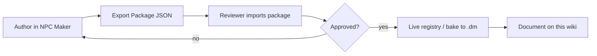

# Developer Handbook

Internal reference for volunteer devs authoring **quests, NPCs, encounters, and items**. Players are welcome to read this, but everything here is spoiler/internals territory.

## How the content pipeline works

Quests and NPCs are **data, not code**. They're authored in the in-game **NPC Maker** (Quests tab for quests), stored in a global registry persisted to `savefiles/quest_templates.json`, and given/turned in exclusively through NPC **dialogue choices**. No DM compile is needed for a live-workshop quest; reviewed content can additionally be baked to `.dm` for permanence.

## Handbook contents

- [Quest Template Reference](quest-template-reference.md) — every field on a quest template, with types and gotchas.
- [Objectives & Event Hooks](objectives-and-events.md) — all objective types, their target matching, and the game events that drive progress.
- [Dialogue & NPC Maker Workflow](dialogue-and-npc-maker.md) — wiring quests into dialogue, and the package export/import review cycle.
- [Quest Data Registry](quest-data-registry.md) — **the dev-side mirror of the Quest Index**: template ids, flags, prereq chains, and reward internals for every documented quest.
- [Page Templates](page-templates.md) — copy-paste skeletons for wiki pages.

## Coordination rules

1. **Claim before you build.** Open a GitHub Issue titled `[Quest] <working name>` (or `[NPC]`/`[Arc]`) describing what you're making and which village it touches. This prevents two people writing conflicting content.
2. **Lore first.** Read the [Canon Policy](../lore/canon-policy.md). Big arcs need an admin's "approved to draft" before you invest hours in the NPC Maker.
3. **Ship the wiki page with the content.** A quest isn't done until its public page and its [Quest Data Registry](quest-data-registry.md) entry exist. The registry entry is what lets the next dev avoid colliding with your flags and chains.
4. **Flags are a shared namespace.** Prereq flags (`prereq_flags` / `prereq_flags_not`) are global PVEflags — check the registry for existing flag names before inventing new ones, and prefix story-arc flags with the arc name (e.g. `whitehunt_step1`).
5. **Quest ids** must be unique and contain no `;`. Convention: `q_<arc>_<short>` (e.g. `q_whitehunt_cull`).
