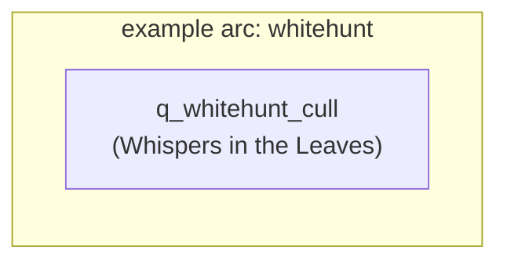

# Quest Data Registry

**The dev-side mirror of the [Quest Index](../quests/index.md).** One entry per quest: template id, flags, chain position, and reward internals. This page is what prevents two authors from colliding on flags, ids, and chains — keep it current. A quest PR that doesn't update this page isn't done.

## Flag namespace

All PVEflags used by quest prereqs. Check here before inventing a flag; prefix with your arc name.

| Flag | Set by | Read by | Arc |
|---|---|---|---|
| *None yet* | | | |

## Chain map

## Registry entries

### q_whitehunt_cull — Whispers in the Leaves *(example)*

| Field | Value |
|---|---|
| **Template id** | `q_whitehunt_cull` |
| **Public page** | [Whispers in the Leaves](../quests/whispers-in-the-leaves.md) |
| **Giver NPC** | Chunin Gate Guard (`npc_template_id`: `npc_konoha_gateguard`) |
| **Objective** | `kill_npc`, `target_kind=category`, `target=zetsu`, `goal=8` |
| **Lifecycle** | `repeatable=1`, `cooldown_hours=24`, `time_limit_min=0` |
| **Rewards** | `reward_xp=1500`, `reward_ryo=300`, `reward_loot=""` |
| **Prereqs** | `prereq_min_level=5`; no flags, no chain |
| **Flags set/read** | none |
| **Pins** | area pin at objective zone; `turnin_pin=1` |
| **Dialogue nodes** | Give: node 2 choice "I'll look into it" (`give_quest`); Turn-in: node 3 (`complete_quest`, `require_quest_state=ready`) |
| **Status** | 📝 Example only — not in game |

*(Copy this block from [Page Templates](page-templates.md#quest-registry-entry-dev) for each new quest.)*
